# uollp - UltraLowProfile x Ortholinear
uollp はウルトラロープロファイル x オーソリニアの自作キーボードです。

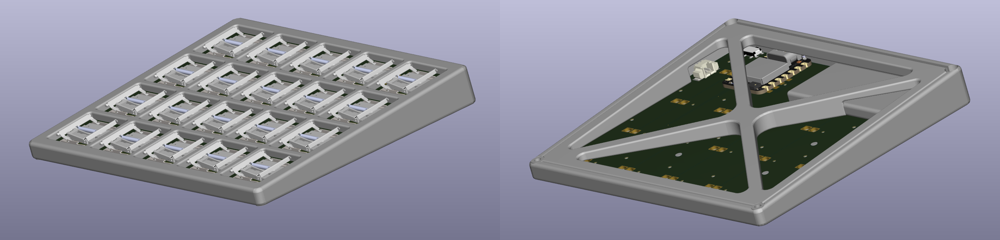
> [!CAUTION]
> このビルドガイドは、ある程度自作キーボードの作成に慣れている方向けの粒度で記載しています。
>  **初めての方はもちろん、不慣れな方は注意してください。**

## 必要部品(片手分)
部品|必要数
-|-
基板 | 1
M2ネジ2mm | 4
プリントケース(トップ/ボトム/スイッチ) | 1
SeeedStudioXIAO nrf52840 | 1
スライドスイッチ, 1.25mmピッチ2極コネクタ | 1
LiPoバッテリ(402050) | 1
1N4148W, CPG1316S01D02 | 20, 24, 30

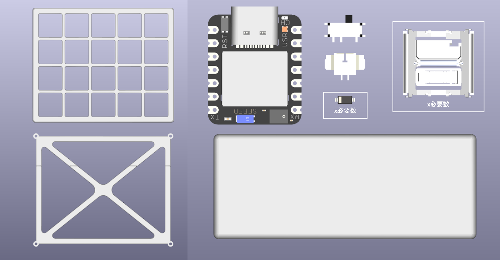

## 作業手順
### ダイオードのはんだ付け
一般的な自作キーボードと同様、向きに注意してください。

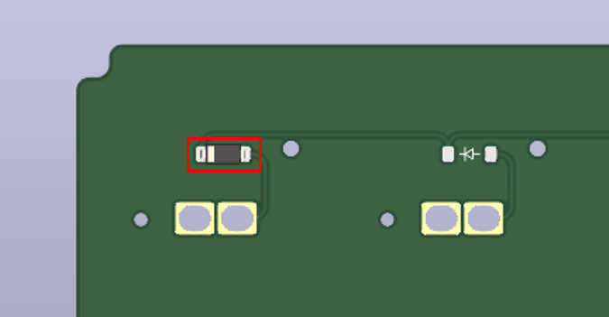
> [!IMPORTANT]
> このダイオードの上にスイッチを取り付けします。 
> スイッチ取り付け後の補正は面倒なため、慎重にはんだ付けしてください。

### スイッチの配置・固定
上面のはんだは不要です。 
マスキングテープなどで一時的に固定してください。

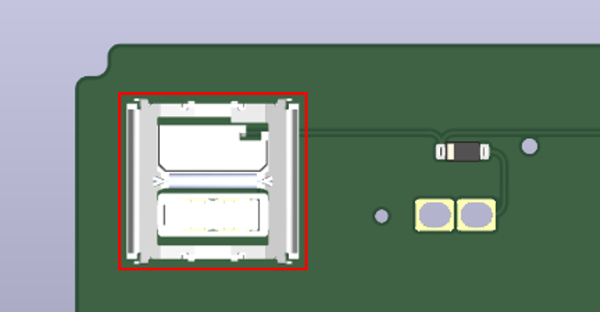

### スイッチのはんだ付け
裏面のスルーホールからはんだ付けします。 
画像の青い部分は一時的にマスキングしてください。

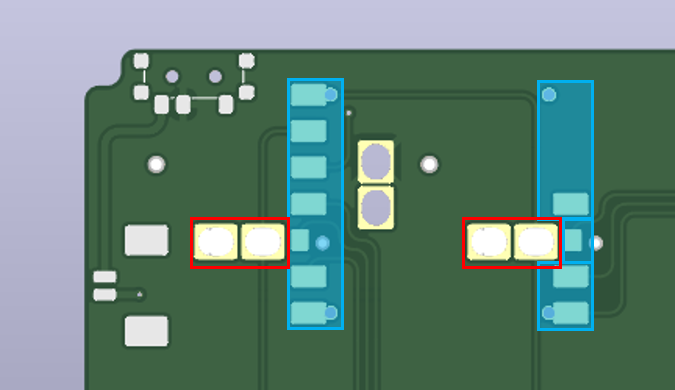

### スライドスイッチ・コネクタのはんだ付け
赤枠部分をはんだ付けします。

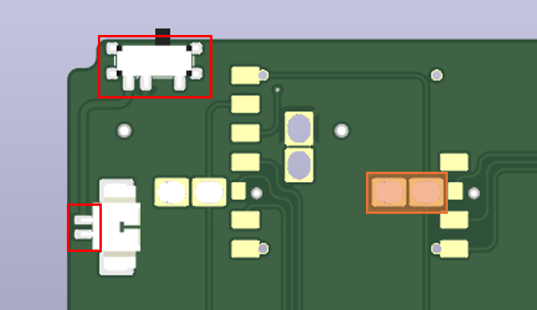
> [!IMPORTANT]
> 画像のオレンジのパッドはマスキングやカプトンなどで絶縁してください。

### マイコンの配置・固定
黄色部分のスルーホールへピンヘッダを差し込み、位置を調整します。 
マスキングテープなどで一時的に固定してください。 
画像の青い部分は一時的にマスキングしてください。

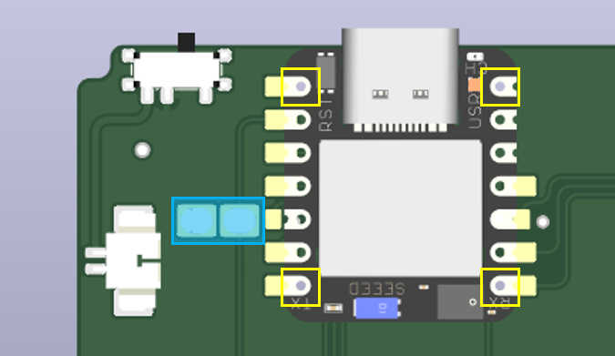
> [!NOTE]
> 7ピンのピンヘッダの中5ピンをペンチなどで引き抜くと、いい感じに使えます。

### マイコンのはんだ付け
裏面のスルーホールからはんだ付けし、表面の11か所をはんだ付けします。

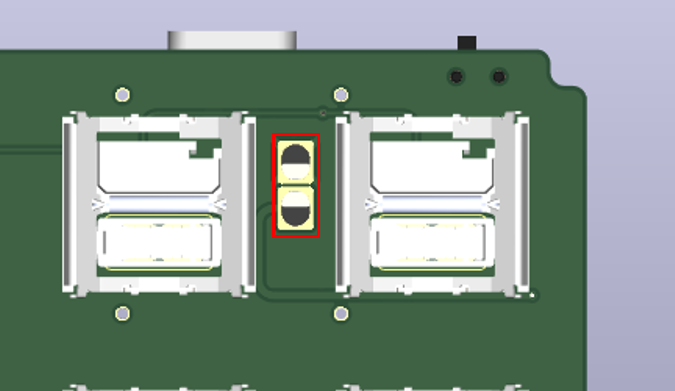
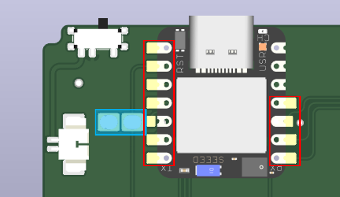

### バッテリとケースの取り付け
トップケースへスイッチカバーを取り付け、基板・バッテリ・ボトムケースを装着します。 
バッテリはマスキングテープなどで基板へ固定してください。 
ボトムケースの裏面四隅へねじ止めします。

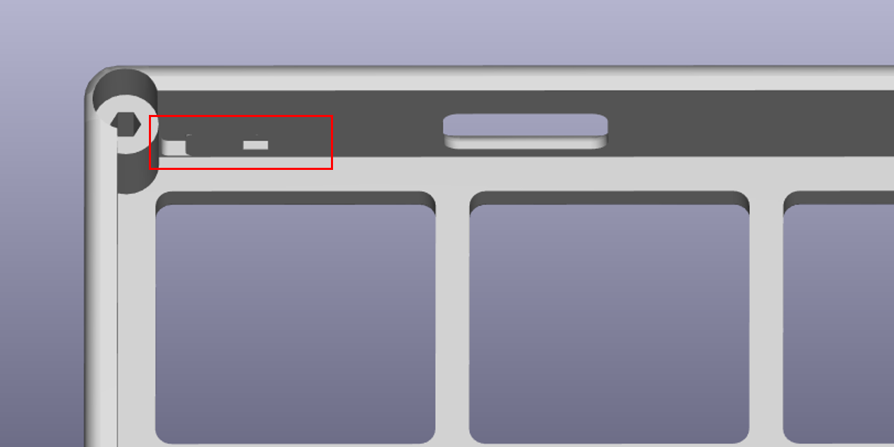
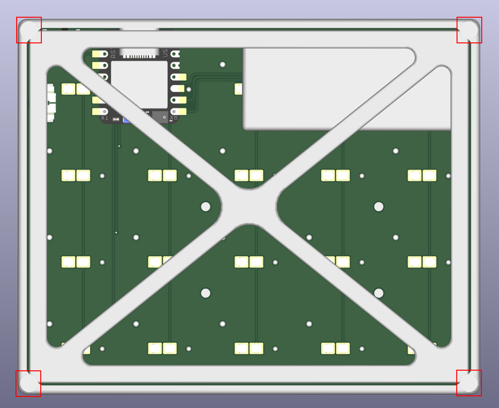

> [!IMPORTANT]
> プリント部品へのネジ彫りのため、少しずつ力を入れ様子を見なら締めてください。

## ファームウェア - ZMK Firmware
[zmk-config-uollp-template](https://github.com/skubmdi/zmk-config-uollp-template) をフォークして使用してください。
